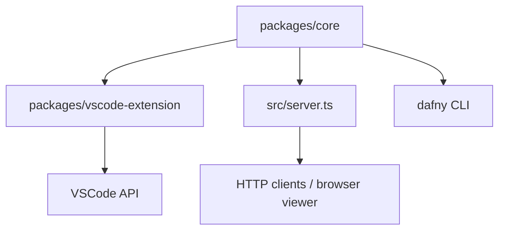

# Design Document

## Overview

Convert ProofPulse from JS to TS. Extract a shared `core` library (log parsing, proof graph, coverage, Dafny runner). Build a VSCode extension consuming core for inline decorations and hover diagnostics. Refactor existing web API to also consume core.

### Project Layout

```
packages/
  core/           # Shared TS library (ES module)
    src/
      types.ts        # Enums, interfaces
      node.ts         # Node class
      proof-graph.ts  # ProofGraph class
      proof.ts        # Proof class (parser + coverage)
      dafny-runner.ts # Spawn dafny, return log
      coverage.ts     # Line status, queries
      serialization.ts # ProofGraph JSON round-trip
      index.ts        # Public API barrel
    tsconfig.json
    package.json
  vscode-extension/  # VSCode extension
    src/
      extension.ts    # activate/deactivate
      commands.ts     # Run analysis command
      decorations.ts  # Gutter + inline decoration types
      hover.ts        # HoverProvider
      config.ts       # Settings wrapper
    package.json      # VSCode extension manifest
    tsconfig.json
src/
  server.ts           # Refactored web API importing @proofpulse/core
  app.js              # Browser viewer (unchanged)
  ...
```

Monorepo with npm workspaces. `packages/core` publishes as `@proofpulse/core`. Extension and server both depend on it.

## Architecture



Core is pure logic + child_process spawn. No VSCode or HTTP dependencies.

Extension imports core, calls `runDafny()` → `parseProof()` → `computeLineStatus()`, then maps results to VSCode decoration types and hover providers.

Server imports core, replaces inline `spans_provider.js` usage.

## Components and Interfaces

### Core — types.ts

```typescript
export enum CovStatus {
  CovComplete = "CovComplete",
  CovTest = "CovTest",
  Uncovered = "Uncovered",
}

export enum TokenType {
  Undefined = "Undefined",
  Precondition = "Precondition",
  Postcondition = "Postcondition",
  AssertionManual = "AssertionManual",
  AssertionAutomatic = "AssertionAutomatic",
  CodeLine = "CodeLine",
}

export interface SourceLocation {
  line: number;
  col: number;
}

export interface NodeData {
  id: string;
  file: string;
  start: SourceLocation;
  end: SourceLocation;
  prooftext: string;
  isTopAssertion: boolean;
  type: TokenType;
  covStatus: CovStatus;
  covStatusInternal: CovStatus;
}

export interface DafnyResult {
  log: string;
  exitCode: number;
  timedOut?: boolean;
  error?: string;
}

export interface DafnyOptions {
  dafnyPath?: string;       // default "dafny"
  timeoutSeconds?: number;  // default 60
}
```

### Core — node.ts

```typescript
export class Node {
  id: string;
  file: string;
  start: SourceLocation;
  end: SourceLocation;
  prooftext: string;
  isTopAssertion: boolean;
  topAliasNode: Node | null;
  covStatus: CovStatus;
  covStatusInternal: CovStatus;
  type: TokenType;
  proves: Set<Node>;
  provedBy: Set<Node>;

  constructor(file: string, sLine: number, sCol: number,
              eLine: number, eCol: number,
              prooftext: string, isTopAssertion: boolean);
  updateIsTopAssertion(isTop: boolean): void;
  connectTo(target: Node): void;
  toJSON(): NodeData;
  static fromJSON(data: NodeData): Node;
}
```

Same heuristic logic as current `spans_provider.js` Node class. `toJSON`/`fromJSON` enable round-trip serialization.

### Core — proof-graph.ts

```typescript
export class ProofGraph {
  private nodes: Map<string, Node>;
  private topNodes: Map<string, Node>;

  addNode(node: Node): void;
  getNode(id: string): Node | undefined;
  hasNode(id: string): boolean;
  addTopNode(node: Node): void;
  getTopNode(id: string): Node | undefined;
  hasTopNode(id: string): boolean;
  addEdge(fromId: string, toId: string): void;
  getAllNodes(): Node[];
  getAllTopNodes(): Node[];
  getBFSNeighbors(key: string, isProvedBy: boolean, getAll?: boolean): Node[] | null;

  toJSON(): object;
  static fromJSON(data: object): ProofGraph;
}
```

### Core — proof.ts

```typescript
export class Proof {
  proofGraph: ProofGraph;
  lineStatus: CovStatus[];

  constructor(proofLog: string, sourceCode: string);
  // Internally calls setCoverageStatus() and setLineStatus()
}

export function parseProof(dafnyCode: string, proofLog: string): Proof;
```

Direct port of current `Proof` class. No `root`/`window`/`global` attachment — pure class export.

### Core — dafny-runner.ts

```typescript
export async function runDafny(
  filePath: string,
  options?: DafnyOptions
): Promise<DafnyResult>;
```

Spawns `dafny verify` with coverage/log flags. Writes temp files, reads prover_log.txt, cleans up. Extracted from current `server.js` and `test_logic.js`.

### Core — coverage.ts

```typescript
export function computeLineStatus(graph: ProofGraph, sourceCode: string): CovStatus[];
export function getNodesByLine(graph: ProofGraph, line: number): Node[];
export function getRelatedNodes(graph: ProofGraph, nodeId: string): Node[] | null;
export function getNodeInfo(graph: ProofGraph, nodeId: string): NodeData | undefined;
```

### Core — serialization.ts

```typescript
export function serializeProofGraph(graph: ProofGraph): string; // canonical JSON
export function deserializeProofGraph(json: string): ProofGraph;
```

### VSCode Extension — extension.ts

```typescript
export function activate(context: vscode.ExtensionContext): void;
export function deactivate(): void;
```

Registers command, hover provider, listens for document changes to clear stale decorations.

### VSCode Extension — decorations.ts

```typescript
// Three decoration types
export const uncoveredGutter: vscode.TextEditorDecorationType;   // red gutter
export const covTestGutter: vscode.TextEditorDecorationType;     // blue gutter
export const uncoveredInline: vscode.TextEditorDecorationType;   // red text
export const covTestInline: vscode.TextEditorDecorationType;     // blue text

export function applyDecorations(
  editor: vscode.TextEditor,
  lineStatus: CovStatus[],
  nodes: Node[]
): void;

export function clearDecorations(editor: vscode.TextEditor): void;
```

### VSCode Extension — hover.ts

```typescript
export class ProofPulseHoverProvider implements vscode.HoverProvider {
  constructor(private graph: ProofGraph);
  provideHover(
    document: vscode.TextDocument,
    position: vscode.Position
  ): vscode.Hover | undefined;
}
```

Looks up nodes at position, formats tooltip with CovStatus, proof text, location, type, CovStatusInternal, and BFS neighbors.

### VSCode Extension — commands.ts

```typescript
export function registerRunAnalysis(context: vscode.ExtensionContext): void;
```

Implements "ProofPulse: Run Coverage Analysis": validates active .dfy file, shows progress, calls `runDafny()` → `parseProof()`, applies decorations, registers hover.

### VSCode Extension — config.ts

```typescript
export function getDafnyPath(): string;      // reads proofpulse.dafnyPath
export function getTimeout(): number;        // reads proofpulse.timeoutSeconds
```

## Data Models

### ProofGraph JSON Schema

```json
{
  "nodes": [
    {
      "id": "file.dfy:1,1-2,5",
      "file": "file.dfy",
      "start": { "line": 1, "col": 1 },
      "end": { "line": 2, "col": 5 },
      "prooftext": "this postcondition holds",
      "isTopAssertion": true,
      "type": "Postcondition",
      "covStatus": "CovComplete",
      "covStatusInternal": "CovComplete"
    }
  ],
  "topNodeIds": ["file.dfy:1,1-2,5"],
  "edges": [
    { "from": "file.dfy:1,1-2,5", "to": "file.dfy:3,1-3,10" }
  ]
}
```

### VSCode Extension Manifest (contributes)

```json
{
  "commands": [
    { "command": "proofpulse.runAnalysis", "title": "ProofPulse: Run Coverage Analysis" }
  ],
  "configuration": {
    "properties": {
      "proofpulse.dafnyPath": { "type": "string", "default": "dafny" },
      "proofpulse.timeoutSeconds": { "type": "number", "default": 60 }
    }
  }
}
```

### Build Configuration

- `packages/core/tsconfig.json`: strict, ES2022 target, ESNext modules, declaration emit
- `packages/vscode-extension/tsconfig.json`: strict, ES2022, CommonJS (VSCode requires CJS), references core
- Extension bundled with esbuild (single file output for fast activation)
- Root `package.json` uses npm workspaces: `["packages/*"]`

## Correctness Properties

*A property is a characteristic or behavior that should hold true across all valid executions of a system — essentially, a formal statement about what the system should do. Properties serve as the bridge between human-readable specifications and machine-verifiable correctness guarantees.*

### Property 1: ProofGraph JSON round-trip

*For any* valid ProofGraph (whether constructed from a parsed prover log or programmatically), serializing to JSON then deserializing then re-serializing SHALL produce identical JSON output.

**Validates: Requirements 1.4, 3.7**

### Property 2: Log parsing produces structurally valid graph

*For any* valid prover log string, parsing it SHALL produce a ProofGraph where every edge references two existing nodes (no dangling edges), every node has a valid TokenType, and all top nodes are present in the nodes map.

**Validates: Requirements 3.1, 3.5**

### Property 3: TokenType assignment matches heuristic

*For any* Node with a given prooftext string, the assigned TokenType SHALL match the heuristic rules: "this postcondition holds" or "ensures clause" → Postcondition, "method requires clause" → Precondition, "assertion always holds" → AssertionManual, automatic patterns (index in range, target object never null, definite-assignment) or isTopAssertion → AssertionAutomatic, else → CodeLine.

**Validates: Requirements 3.2**

### Property 4: CovStatusInternal follows BFS reachability from top assertions

*For any* ProofGraph, a node reachable via BFS from a Postcondition top node SHALL have CovStatusInternal = CovComplete, a node reachable only from non-Postcondition top nodes SHALL have CovStatusInternal = CovTest, and unreachable nodes SHALL remain Uncovered.

**Validates: Requirements 3.3**

### Property 5: CovStatus follows token-class policies

*For any* ProofGraph with CovStatusInternal computed, CovStatus SHALL satisfy: AssertionAutomatic nodes are always CovComplete; AssertionManual nodes are CovComplete only if CovStatusInternal is CovComplete, else Uncovered; CodeLine and Precondition nodes equal their CovStatusInternal; Postcondition top nodes follow the alias/parent/child policy.

**Validates: Requirements 3.4**

### Property 6: Line status is worst-case of token statuses

*For any* ProofGraph and source code string, the computed Line_Status for each line SHALL equal the worst-case CovStatus (Uncovered > CovTest > CovComplete) among all nodes whose source span includes that line, defaulting to CovComplete if no tokens exist on that line.

**Validates: Requirements 4.1**

### Property 7: BFS neighbors match transitive closure

*For any* ProofGraph and any node ID within it, getBFSNeighbors(id, false, true) SHALL return exactly the set of nodes reachable via transitive traversal of both `proves` and `provedBy` edges (excluding the start node).

**Validates: Requirements 4.2**

### Property 8: getNodesByLine returns exactly span-containing nodes

*For any* ProofGraph and any line number, getNodesByLine SHALL return exactly the nodes where start.line ≤ line ≤ end.line.

**Validates: Requirements 4.4**

### Property 9: Gutter decorations match line status

*For any* Line_Status array, applyDecorations SHALL produce: red gutter decoration ranges for exactly the lines with Uncovered status, blue gutter decoration ranges for exactly the lines with CovTest status, and no gutter decoration for CovComplete lines.

**Validates: Requirements 6.1, 6.2, 6.3**

### Property 10: Inline decorations match node status

*For any* set of Nodes, applyDecorations SHALL produce: red inline decoration ranges for exactly the tokens with CovStatus = Uncovered, blue inline decoration ranges for exactly the tokens with CovStatus = CovTest, and no inline decoration for CovComplete tokens.

**Validates: Requirements 7.1, 7.2, 7.3**

### Property 11: Hover content contains all required node info and neighbors

*For any* ProofGraph and any node at a hovered position, the hover tooltip SHALL contain the node's CovStatus, proof text, source location, TokenType, CovStatusInternal, and the IDs and proof texts of all BFS neighbors.

**Validates: Requirements 8.1, 8.2**

## Error Handling

| Scenario | Behavior |
|---|---|
| Dafny not in PATH | `runDafny` returns `{ error: "dafny not found" }` |
| Dafny timeout | `runDafny` kills child process, returns `{ timedOut: true }` |
| Dafny non-zero exit | Returns log + exitCode, no throw |
| Malformed prover log | Parser returns empty ProofGraph (no crash) |
| Node ID not found | Query functions return `undefined` / `null` |
| No .dfy file active | Extension shows warning notification |
| Extension command during analysis | Debounce — ignore if already running |
| Temp dir cleanup failure | Swallow error, log to console |

## Testing Strategy

### Property-Based Tests (fast-check, min 100 iterations each)

Core properties (1–8) tested with fast-check generators for:
- Random valid prover log strings (structured generator matching assertion batch format)
- Random ProofGraph objects (random nodes, edges, token types)
- Random source code strings (random line counts)

Extension properties (9–11) tested with:
- Random CovStatus arrays for decoration mapping
- Random Node sets for inline decoration mapping
- Random ProofGraph + position for hover content

Each test tagged: `Feature: proofpulse-vscode-extension, Property N: <title>`

### Unit Tests (example-based)

- Dafny not found error (Req 2.2)
- Dafny timeout error (Req 2.3)
- Dafny non-zero exit returns log (Req 2.4)
- Serialization produces valid JSON (Req 3.6)
- No tooltip when no coverage data at position (Req 8.3)
- Clear decorations on document edit (Req 6.4)
- Warning when no .dfy active (Req 9.5)
- Error notification on Dafny failure (Req 9.4)
- Progress indicator shown during analysis (Req 9.2)
- Custom dafnyPath used when configured (Req 10.3)

### Integration Tests

- Web API routes return same responses after refactor (Req 5.2, 5.3)
- Full analysis pipeline: runDafny → parseProof → decorations (Req 9.3)

### Smoke Tests

- tsconfig.json has strict: true (Req 1.1)
- Core barrel exports all expected symbols (Req 1.2)
- Command registered in package.json (Req 9.1)
- Configuration defaults correct (Req 10.1, 10.2)
- Server imports from @proofpulse/core (Req 5.1)

